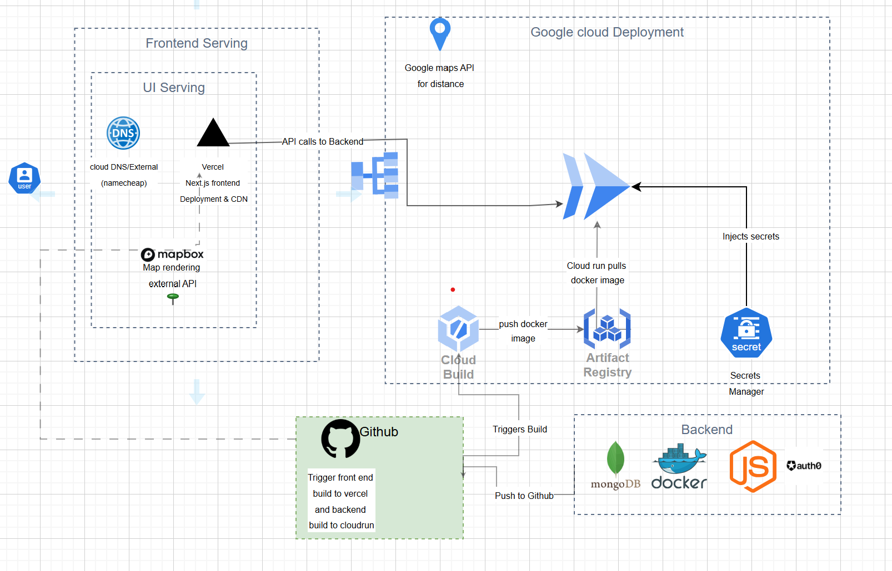
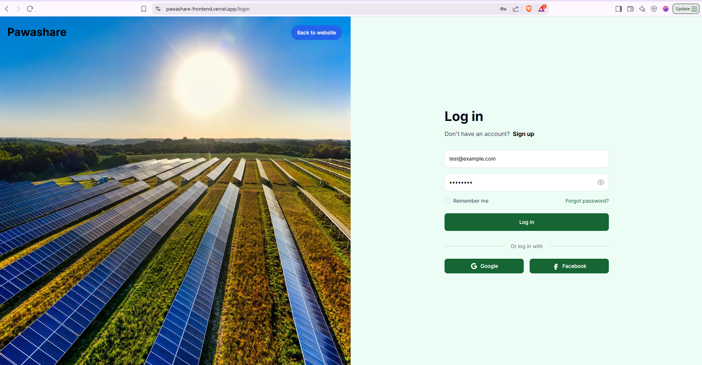

# PawaShare - Progress Update
##  Architecture Diagram

###  Work Summary (Accomplished)

*   Created GitHub repositories and version control policies (branching, PRs).
*   Set up Vercel and GCP accounts.
*   Dockerized frontend and backend applications.
*   Implemented CI/CD pipelines:
    *   GitHub Actions for frontend (Lint, Type-check, Build, Deploy).
    *   Cloud Build for backend (Docker build & push, Cloud Run deploy).
*   Configured API integration paths between frontend and backend.
*   **Verified backend deployment accessibility via its base URL.** 
*   **Successfully tested end-to-end user authentication flow (signup and login), confirming frontend-backend integration.** 

###  URLs & Links

*   **Frontend Production:** [pawashare-frontend.vercel.app](https://pawashare-frontend.vercel.app)
*   **API Endpoint (Cloud Run):** [pawashare-backend-856444188471.us-central1.run.app](https://pawashare-backend-856444188471.us-central1.run.app)
*   **Postman Collection:** [link to Postman](https://pawashare.postman.co/workspace/PAWASHARE-Workspace~9a3c8610-ddeb-4f7f-a9de-15d7b34079f2/collection/38838735-c6ab6cb1-4332-4cf4-bbff-9e63bc0f5e23?action=share&creator=38838735)
*   **Figma Design:** [link to figma](https://www.figma.com/design/puwjUHFuqK0KCo6Lv8zD0l/P1?node-id=108-68)
*   **GitHub Repositories:** [Link to Frontend Repo](https://github.com/Althub-Team17/pawashare-frontend) | [Link to Backend Repo](https://github.com/Althub-Team17/pawashare-backend)
*   **Terraform Code:** [./terraform/README.md](./terraform/README.md)

##  Project Overview

#### PawaShare is a solar energy sharing platform enabling communities to rent, lend, or subscribe to solar-powered resources.

**Platform Architecture:**

*   **Frontend:** Next.js + Tailwind deployed via Vercel
*   **Backend:** Node.js + Express containerized and deployed to Google Cloud Run
*   **CI/CD:** GitHub Actions (Frontend) and Google Cloud Build (Backend)
*   **Containerization:** Docker
*   **Version Control:** GitHub (with PR flows)
*   **Secrets Management:** GitHub Secrets (Vercel) & GCP Secret Manager (Cloud Run)

##  CI/CD Architecture Details
###  Frontend – Vercel

*   **Repository:** `pawashare-frontend`
*   **Hosting:** Vercel (Free Tier)
*   **Deploy Trigger:** On push to `main` branch
*   **Build Tool:** GitHub Actions + Vercel Action (`amondnet/vercel-action@v20`)
*   **Secrets:** Managed via GitHub Secrets & Vercel Dashboard (`VERCEL_TOKEN`, `VERCEL_PROJECT_ID`, `VERCEL_ORG_ID`)
*   **Optimizations:**
    *   `.next/cache` cached using `actions/cache@v3`
    *   Linting & type-checking enabled
    *   Fallback API environment variables for localhost

###  Backend – Google Cloud Run

*   **Repository:** `pawashare-backend` (Assumed name, replace if different)
*   **Hosting:** Google Cloud Run
*   **Trigger:** Push to `main` branch initiates Cloud Build via GCP webhook trigger.
*   **Build Tool:** Google Cloud Build (using inline YAML definition in the trigger).
*   **Runtime:** Dockerized Node.js application.
*   **API Docs:** Swagger documented.
*   **Infrastructure Management:** The underlying GCP resources (Artifact Registry, Cloud Run Service, Cloud Build Trigger) are managed via Terraform. See the [Terraform README](./terraform/README.md) for details.

#### Cloud Build Pipeline Steps:

1.  **Build Docker Image:**
    *   Uses `gcr.io/cloud-builders/docker`.
    *   Builds image using `backend/Dockerfile`.
    *   Tags image: `us-central1-docker.pkg.dev/endless-phoenix-453318-h6/cloud-run-source-deploy/pawashare-backend:$COMMIT_SHA`.
2.  **Push to Artifact Registry:**
    *   Uses `gcr.io/cloud-builders/docker`.
    *   Pushes tagged image to `us-central1-docker.pkg.dev/endless-phoenix-453318-h6/cloud-run-source-deploy`.
3.  **Deploy to Cloud Run:**
    *   Uses `gcr.io/google.com/cloudsdktool/cloud-sdk:slim`.
    *   Updates the `pawashare-backend` service in `us-central1`.
    *   Deploys the new image from Artifact Registry.
    *   Applies tracking labels.

*   **Substitutions:** Uses Cloud Build substitutions (e.g., `_SERVICE_NAME`, `_DEPLOY_REGION`) for configuration.
*   **Environment Variables:** Managed in Cloud Run service settings (potentially populated via GCP Secret Manager). Secrets are injected at runtime.
*   **Deployment Logs:** Available in GCP Cloud Logging.

##  Secrets & Environment Management Summary

| Environment | Tool                                     | Variables Used                     |
| :---------- | :--------------------------------------- | :--------------------------------- |
| Vercel      | GitHub Secrets + Vercel Dashboard        | `VERCEL_*`, `NEXT_PUBLIC_API_URL`  |
| GCP         | GCP Secret Manager + Cloud Run Settings  | `MONGO_URI`, `NODE_ENV`, JWT/secrets |

##  Containerization

*   **Docker Setup:** Separate `Dockerfile` for frontend and backend (using multi-stage builds for production).
*   **Docker Compose:** Planned for local development environment setup.
*   **ECR Support (Optional):** Images are standard OCI images, portable to other registries like AWS ECR if needed.

##  Deployment Strategy

| Layer    | Platform         | Tool             | Action                             |
| :------- | :--------------- | :--------------- | :--------------------------------- |
| Frontend | Vercel           | GitHub Actions   | Auto-deploy on PR merge to `main`  |
| Backend  | Google Cloud Run | Cloud Build      | Auto-deploy container on push to `main` |

##  Tools Used

*   **CI/CD:** GitHub Actions, Google Cloud Build
*   **Containers:** Docker
*   **Deployment:** Vercel (Frontend), Cloud Run (Backend)
*   **Infrastructure:** Terraform (for GCP resources), Cloud IAM (manual roles)
*   **Monitoring:** GCP Cloud Logging (basic)
*   **Secrets:** GitHub Secrets, GCP Secret Manager (manual config)

##  Planned Improvements

| Feature                       | Status      | Notes                                                                 |
| :---------------------------- | :---------- | :-------------------------------------------------------------------- |
| GitHub Actions Reproducibility| In Progress | Resolve Vercel auto-deploy conflicts; prefer GitHub-managed deployment. |
| Backend Field Alignment       | In Progress | Add missing `userType` field to API.                                  |
| Frontend Preview Deployments  | Done        | Vercel previews available for every PR.                               |
| Security & Monitoring         | Coming Soon | Integrate Snyk, Log-based metrics, or Grafana.                        |
| Terraform Provisioning        | Done        | Backend infra (AR, Run, Build Trigger) managed via Terraform.         |

## Appendix: Why Cloud Run?

| Reason          | Explanation                                                                 |
| :-------------- | :-------------------------------------------------------------------------- |
| Cost Efficiency | Generous free tier; pay-per-use model avoids idle VM costs.                 |
| Auto Scaling    | Scales from zero to handle traffic spikes automatically.                    |
| Simplicity      | Abstracts away OS, patching, and server management.                         |
| CI/CD Ready     | Tight integration with Cloud Build, Artifact Registry, and source control.  |
| Security        | Managed HTTPS, private networking options, IAM integration.                 |
